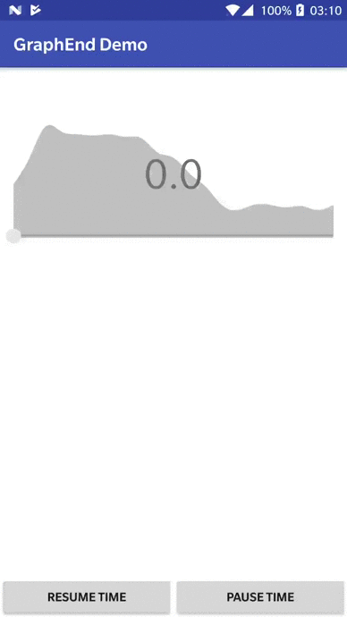

# PointGraph
PointGraph library is a group of optimized and well-designed interactive Android Views whose main feature is graphical representation of list of points in form of a ["spline"](https://en.wikipedia.org/wiki/Spline_(mathematics)).

And... it's written in Kotlin!

[](https://jitpack.io/#johnnymartinovic/PointGraph)

## Demos
| LaGrange                    | GraphEnd                    |
|:---------------------------:|:---------------------------:|
|||

## Download
This library is available in JitPack.io repository:
```groovy
allprojects {
    repositories {
        maven { url "https://jitpack.io" }
    }
}
```

In your app level build.gradle add:
```groovy
dependencies {
    implementation 'com.github.johnnymartinovic:PointGraph:1.0.0'
}
```

## Features
- Easily present list of points in form of a ["splined"](https://en.wikipedia.org/wiki/Spline_(mathematics)) graph
- Use helping classes to make PointsData objects needed for PointGraphs
- Allow user to select range by moving graph selectors
- Modify graph data and range values with included animation

## Usage examples
### LaGrange

- Change selector values by touch or programatically
- Listen to selectors changes
- Change custom attributes values
- Get selected range min and max values

```xml
<com.johnnym.pointgraph.LaGrange
    android:id="@+id/la_grange"
    android:layout_width="match_parent"
    android:layout_height="match_parent"/>
```

```kotlin
private val laGrange: LaGrange by bindView(R.id.la_grange)

val rangeDataList = listOf(
    Range(0f, 20f, 0f),
    Range(21f, 40f, 30f),
    Range(41f, 60f, 50f),
    Range(61f, 80f, 30f),
    Range(81f, 100f, 60f),
    Range(101f, 120f, 60f),
    Range(121f, 140f, 55f))

laGrange.setPointsData(RangeData(rangeDataList).pointsData)

laGrange.addMinSelectorChangeListener(minSelectorPositionChangeListener)
laGrange.addMaxSelectorChangeListener(maxSelectorPositionChangeListener)

laGrange.setSelectorsValues(minValue, maxValue)
```

### GraphEnd

- Change selector value by touch or programatically
- Listen to selector changes
- Change custom attributes values
- Change graph visibility

```xml
<com.johnnym.pointgraph.GraphEnd
    android:id="@+id/graph_end"
    android:layout_width="match_parent"
    android:layout_height="match_parent"/>
```

```kotlin
private val graphEnd: GraphEnd by bindView(R.id.graph_end)

val points = listOf(
    Point(0f, 200f),
    Point(1f, 300f),
    Point(2f, 420f),
    Point(3f, 400f),
    Point(4f, 390f),
    Point(5f, 385f),
    Point(6f, 390f),
    Point(7f, 380f))

graphEnd.setPointsData(PointsData(points))

graphEnd.addSelectorListener(selectorListener)

graphEnd.toggleGraphVisibility()
```

Also, check out a [sample app](https://github.com/johnnymartinovic/PointGraph/tree/master/sample) included in this project to see how to use this library in a more advanced way.

## License

```
Copyright 2017 Ivan Martinovic

Licensed under the Apache License, Version 2.0 (the "License");
you may not use this file except in compliance with the License.
You may obtain a copy of the License at

http://www.apache.org/licenses/LICENSE-2.0

Unless required by applicable law or agreed to in writing, software
distributed under the License is distributed on an "AS IS" BASIS,
WITHOUT WARRANTIES OR CONDITIONS OF ANY KIND, either express or implied.
See the License for the specific language governing permissions and
limitations under the License.
```